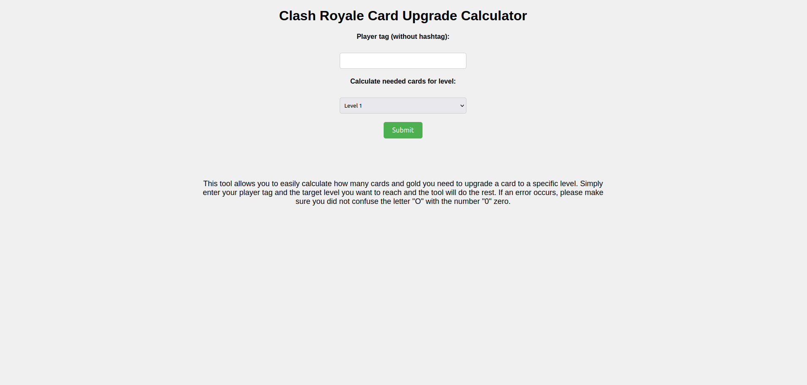
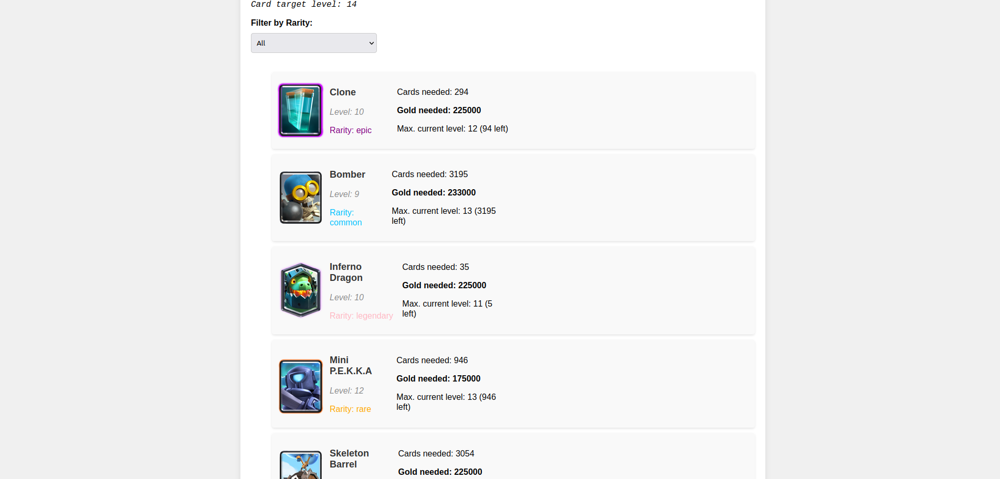

# Clash Royale Card Upgrade Calculator

This tool allows you to easily calculate how many cards and gold you need to upgrade a card to a specific level.
Simply enter your player tag and the target level you want to reach and the tool will do the rest.
You can also filter by card rarity to find cards easier.

# Requirements
- flask
- requests

# Setup
- Supercell API token in "token.txt" file in the root directory
- Card image files in the format *Card Name*.png, best way to obtain them is by downloading them using `setup.py`